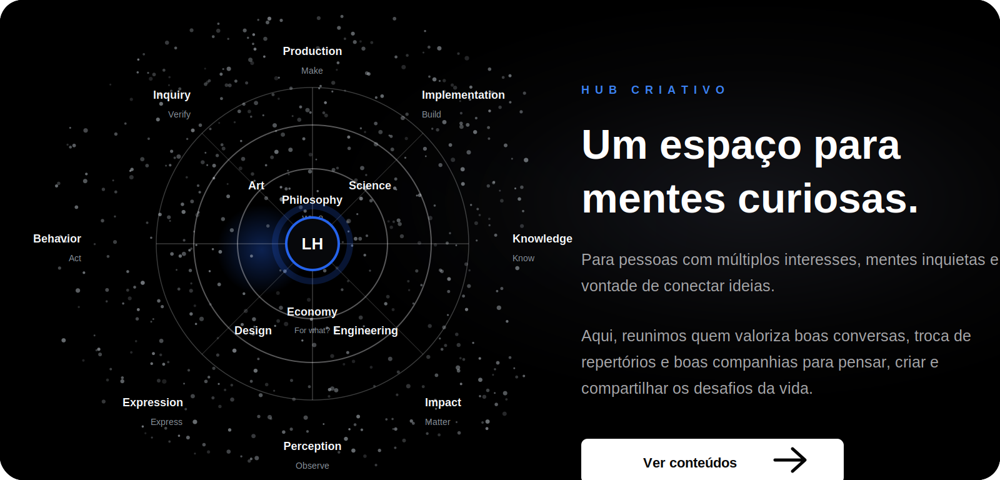

 

---

<table>
  <tr>
    <td width="50%">
      
<b>01 / INTRODUCTION</b>

      <h2>Projetos, artigos e aprendizados organizados como um <i>System</i>.</h2>
      

        Um acervo vivo para conectar ideias, transformar repertório em software
        e construir soluções que continuam evoluindo com o tempo.
      

    </td>
    <td width="50%">
      
<b>02 / ABOUT</b>

      <h2>Systems over features.</h2>
      

        Eu desenho e construo sistemas backend, ferramentas para desenvolvedores
        e infraestrutura cloud com foco em clareza, simplicidade e confiabilidade.
      

    </td>
  </tr>
</table>

> Este GitHub é a vitrine pública. Projetos reais, código de produção, clientes e experimentos sensíveis ficam privados por design.

## How I Work

| Step | Principle | Output |
| --- | --- | --- |
| **UN** | Understand | Clarear o problema, limites e objetivos. |
| **DE** | Design | Modelar o sistema e escolher boas abstrações. |
| **BU** | Build | Implementar com foco em qualidade, leitura e testes. |
| **OP** | Operate | Observar, aprender e iterar continuamente. |

## Core Stack

## Content System

| Tema | Conteúdo |
| --- | --- |
| Backend | [Desenho de APIs que duram](https://hub-criativo.pages.dev/contents/desenho-de-apis-que-duram) |
| Dados | [Índices PostgreSQL sem superstição](https://hub-criativo.pages.dev/contents/indices-postgresql-sem-supersticao) |
| Supabase | [RLS no Supabase para produtos reais](https://hub-criativo.pages.dev/contents/rls-supabase-produtos-reais) |
| Algoritmos | [Big O para backend](https://hub-criativo.pages.dev/contents/big-o-para-backend) |
| APIs | [APIs REST na prática](https://hub-criativo.pages.dev/contents/apis-rest-na-pratica) |
| Auth | [Supabase Auth introdução](https://hub-criativo.pages.dev/contents/supabase-auth-introducao) |

## Public Build Map

| Área | O que aparece aqui |
| --- | --- |
| Backend systems | APIs, contratos, autenticação, banco de dados e performance. |
| Developer tools | Scripts, automações e ferramentas para acelerar fluxo de trabalho. |
| AI + automation | Experimentos com assistentes, resumos, conteúdo e produtividade. |
| Web interfaces | React, dashboards e experiências simples de usar. |
| Learning in public | Repos antigos sendo organizados em projetos com contexto e setup. |

## Public Starting Points

- [Python_Youtube](https://github.com/LUCASH-LOPES/Python_Youtube) - experimentos com automação de vídeos/conteúdo.
- [JavaScript-Estudos1](https://github.com/LUCASH-LOPES/JavaScript-Estudos1) - fundamentos de JavaScript e frontend.
- [CURSOGIT](https://github.com/LUCASH-LOPES/CURSOGIT) - estudos e prática de versionamento com Git.

## GitHub Pulse

  
  

## Vamos Conversar

<b>Um sistema público para ideias. Um espaço privado para o que precisa ficar protegido.</b>

